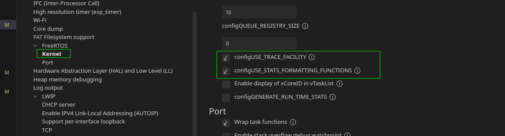

# Esp32 IDF 配置

1. VSCode 插件安装

   插件名称：Espressif IDF，安装完成之后选择 Advanced , 选择乐鑫官网，最新分支，安装。  

2. 创建hello_world模板项目

   `Ctrl + Shift + P` 打开VsCode命令行面板，输入esp-idf : show examples project 功能介绍：

   

3. [系统启动流程](https://docs.espressif.com/projects/esp-idf/zh_CN/v5.0.1/esp32c3/api-guides/startup.html)

4. 常用指令

   ```shell
   // 设置环境变量
   . $HOME/esp/esp-idf/export.sh
   // 构建
   idf.py build 
   // 刷写
   idf.py flash
   // 终端 Ctrl + ] 退出
   /home/MrTan/.espressif/python_env/idf5.0_py3.11_env/bin/python /home/MrTan/esp/esp-idf/tools/idf_monitor.py -p /dev/ttyACM0 -b 460800 --toolchain-prefix riscv32-esp-elf- --target esp32c3 /home/MrTan/project/esp32c3/hello_world/build/hello_world.elf
   // 一键构建刷写并打开终端
   idf.py -p /dev/ttyACM0 flash monitor
   ```


5. 打印FreeRTOS 任务列表需要配置 

6. FreeRTOS 命名规则

   > 变量

   uint32_t：前缀 ul，u 表示 unsigned，l 表示 long

   uint16_t：前缀 us，s 表示 short

   uint8_t：前缀 uc，c 表示 char

   非 stdint 类型的变量使用前缀 x，比如基本的 Type_t 和 TickType_t 类型

   非 stdint 类型的无符号变量使用前缀 ux，比如 UbaseType_t（unsigned BaseType_t）

   size_t 类型的变量使用前缀 x

   枚举类型变量使用前缀 e

   指针类型变量在类型基础上附加前缀 p，比如指向 uint16_t 的指针变量前缀为 pus

   char 类型变量前缀为 c

   char * 类型变量前缀为 pc

   > 函数

   返回值类型 + 所在文件 + 功能名称

   vTaskDelete 该函数返回值为 void 型，定义在 tasks.c，作用是 delete

   xQueueReceive()函数的返回值为 portBASE_TYPE 型，在 queue.c 这个文件中定义，函数作用是 receive 接收。

   > 宏

   宏的名字起始部分为该宏定义所在的文件名的一部分

   configUSE_PREEMPTION 表示定义在 FreeRTOSConfig.h 文件中，作用是 USE_PREEMPTION。

7. idf切换到新的分支

   ```shell
   // 切换到idf目录
   cd idf
   // 拉取最新的提交
   git fetch
   // 切换到最新tag
   git checkout v5.0.2
   // 由于跟新子模块失败，需要删除子模块重新拉取
   rm -rf components
   git submodule update --init --recursive	
   ```

   
